# Jenkins CI-CD pipeline

## Overview of CI-CD

The aim of CI-CD is to fully automate app deployment from scratch to help deliver software faster, speeding up updates and making more money.

The basic overview of the pipeline is...

- Local code -> github -> jenkins -> master node -> tests code on agent node -> pushed to deployment if test successful

Error logs are returned instead of deployment if app doesn't function as expected.

This pipeline consists of two parts...

Continious intergration:


Continious deployment:


Continous delivery is the CI-CD pipeline, up until the actual deployment step.

But **remember**, even though continious deployment has greater automation, continious delivery has some advantages over it.
- You'll want continuous delivery when you don't want the application to be available to customers right away.
- Continuous delivery lets you do new deploys instead when client specifications change
- Also lets you do additional, manual testing among other reasons
- **You can deploy when you're certain the app is ready!**

# Webhooks

Webhooks are used for automation.

It always listens to changes in your github.

When changes occur, this repo will be cloned by jenkins and pipeline starts.

# Building job that tests app in jenkins

First, make sure the app is available in your Github repo, and on the dev branch!

1. Click new item


2. Name it appropriately, then click freestyle and OK
- We want freestyle as it provides the customisation options needed for CI-CD


3. Give appropriate description
4. Tick 'discard old builds' and set number of builds to 3
- This will discard the 1st build logs when a 4th one is made, saves space


Move to **Github**

5. Create new key pair
6. Go to settings then deploy keys
7. Put public key in field 
8. Tick allow write access

- This is the key we will be providing to Jenkins so it can clone our repo.

Then move to **Jenkins**

9. When setting up github connection in jenkins
10. Tick github project here and enter the repo HTTPS

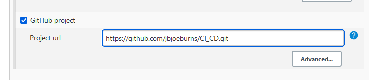

11. Then under source code management tick git and paste your repository SSH

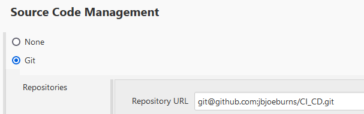

12. Then add the private key for the key you linked to your GitHub earlier

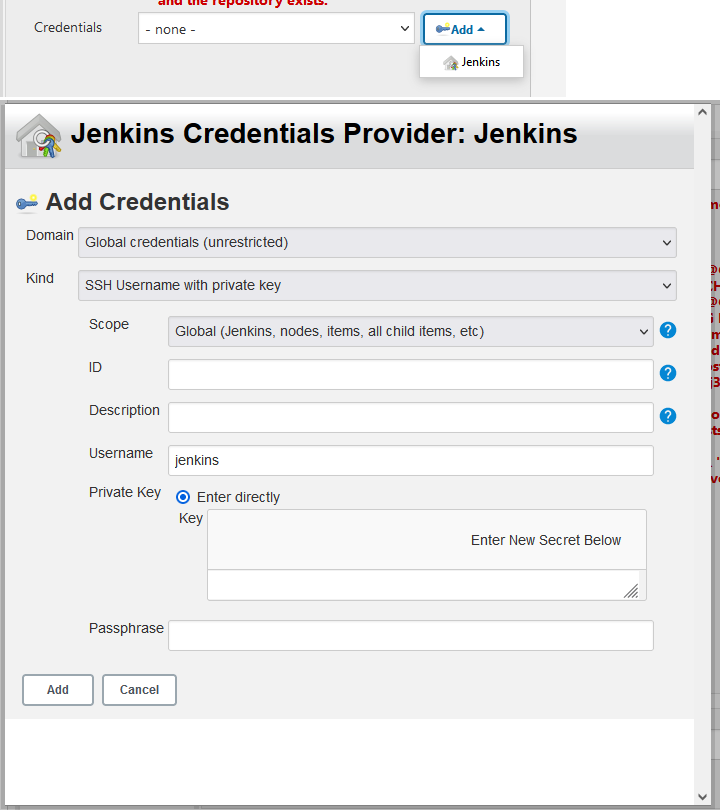

13. You also need to restrict where this can be run using the option under office 365 connector 
- We use the label expression `sparta-ubuntu-node`
- This ensures this only runs on a specific agent/slave node

14. Go to build and select 'execute shell'
15. Include the following code
``` 
#!/bin/bash
cd app/app
npm install
npm test
```
16. Click apply and save

When this job is built, it will run the predefined tests on our application to ensure it can run.

You can view results of test in the logs!

## Running tests when app repo is updated, testing dev then merging dev to main if successful

Make a new job and set it up exactly the same way as the previous job!

However, make the following changes.

1. Go to config on **Jenkins** and tick github trigger in build triggers

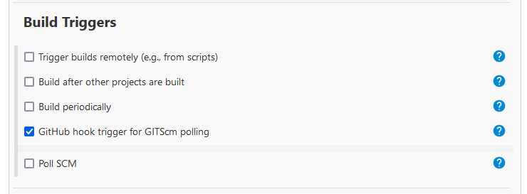

2. You also want to add **merge before build** as an additional behaviour, then specify this should merge with **main**.

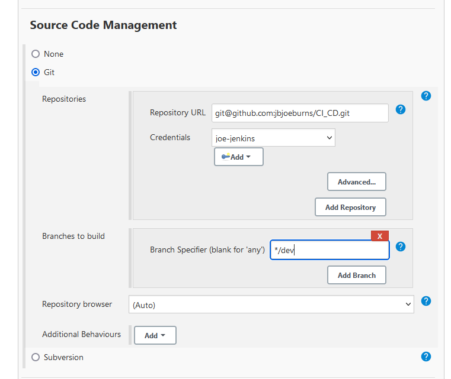

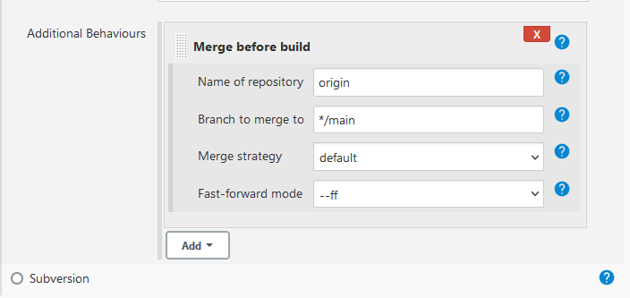

3. go to bottom and under post build options click build other project
- Type the name of the next job you want, which in our case is the app test job we made earlier as we want this to be built once the test job succeeds.

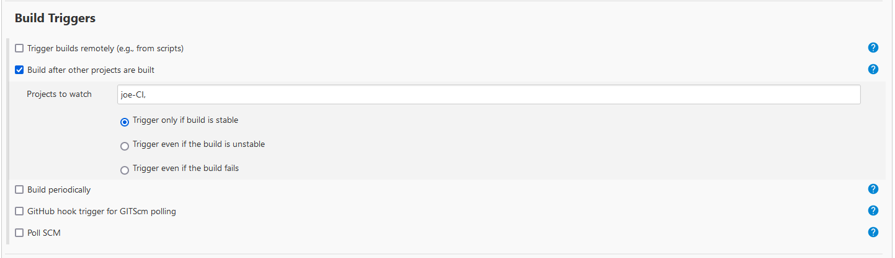

4. Finally, you need to add post build actions so Jenkins knows what to do with the dev branch. If you select **push only if the build succeeds** and **merge results** this will push a merge request once the build finishes. The reason we do it like this is because the merge before build option will test if the branches are accessable and exist, and then the build will succeed. Once it's succeeded then it will merge.

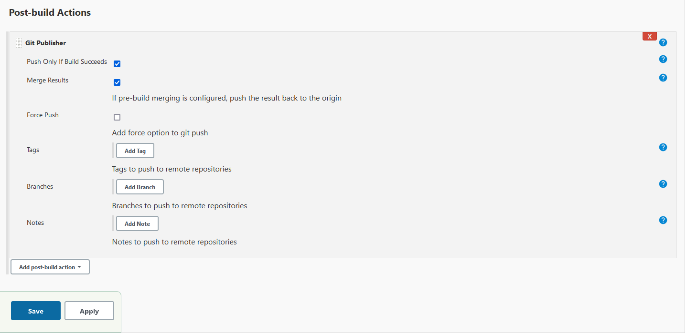

5. Then go to settings in **github repo** and go to webhooks in the dropdown
- Paste the payload URL, which is the URL of Jenkins 
- Should be in this format `http://address:port/github-webhook/`
- Change content type to application/json

6. Then return to the testing (first) job you made and change post build to build other projects and select the merge (second) job you made.


## Letting Jenkins create AWS instance

delete this
```
1. Make new job, do the exact same setup as the 1st job with the following changes

2. Set AWS code deploy plugin as post build

3. Additionally, go to merge job and add post build setting to build this new job.

4. Go back to the new job and tick SSH agent and add AWS key (using doz' for this)

5. Make ASG that allows Jenkins IP with Jenkins port (8080)


Launch EC2 Instance

Add relevant security group to Ec2 instance

Create a third job in jenkins to SSH into environment

Copy code into environment

Install nginx

Share public IP and github document with screenshots of third job and execute shells commands

MUST HAVE A DIAGRAM for CI CD in your repo.

```

## Setting up job that automatically deploys app

### Creating the AWS instance

1. First, we need to create a new AWS instance for Jenkins to use. For this we will create an instance with the following AMI using t2 micro and our usual key-pair login: `ami-0136ddddd07f0584f`.

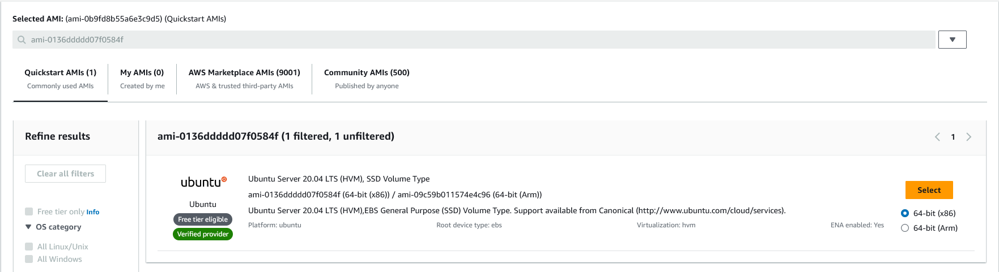

2. Then we need to set up the security groups for this instance. We want the following ports open...
- 8080: This is the port for Jenkins and is required for it to be able to connect.
- 22: The SSH port, needed to connect via SSH.
- 80: The port for HTML, this will be needed to connect to the instance via a browser to test if everything is working.

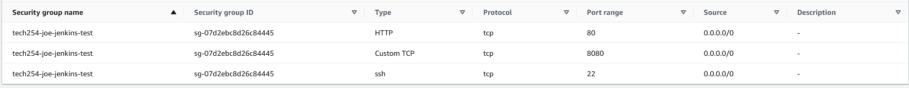

3. We can then deploy this app

### Creating Jenkins job to test we can connect and run nginx

4. Then once the instance is created, we can move onto making a new freestyle Jenkins job

5. We want to make sure we change **max builds** in **log rotation** to 5.
- The reason we do this is because our CI-CD pipeline will consist of more than 5 jobs. This will prevent our builds from being deleted once we get towards the end of the pipeline. **Change this for all jobs in the pipeline too.**

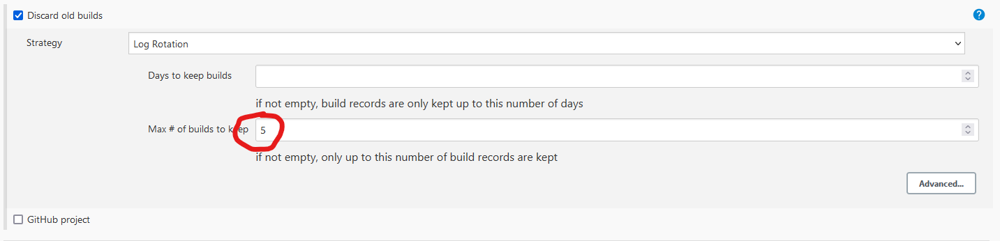

6. Keep **restrict where this can be run** to `sparta-ubuntu-node`

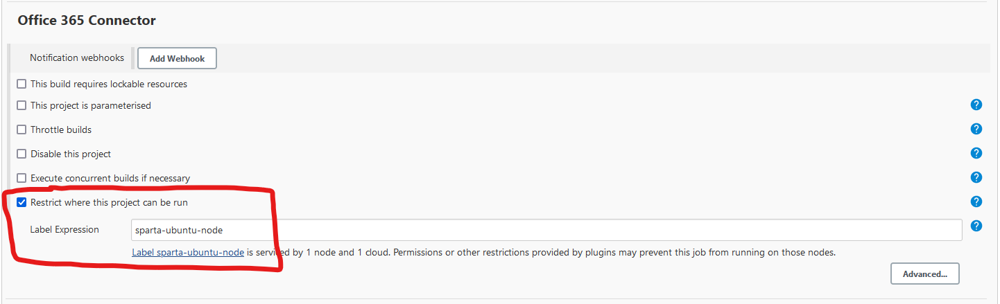

7. Under **build environment** select **SSH agent** and use our ssh pem file.

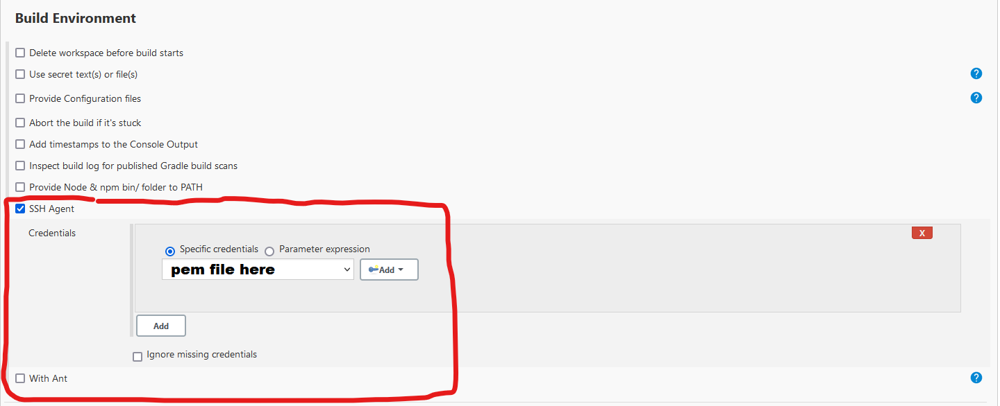

8. Finally, under **execute shell** use the following commands

```
# Allows Jenkins to SSH into the instance.
# -o allows you to change options for the ssh command, and the option StrictHostKeyChecking is disabled as if enabled it will reject any SSH connections that arent from the known host list, including Jenkins
ssh -o "StrictHostKeyChecking=no" ubuntu@<Public IPv4 DNS> <<EOF

# Updates and upgrades installed packages
sudo apt-get update -y
sudo apt-get upgrade -y

# Installs nginx
sudo apt-get install nginx -y

# Restarts and enables nginx
sudo systemctl restart nginx
sudo systemctl enable nginx
```

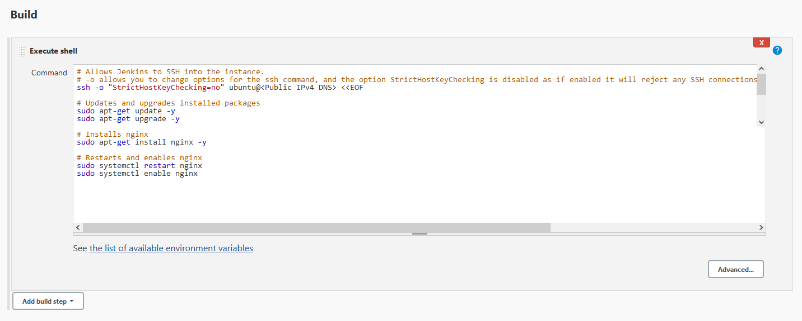

At this point, you should have set something like this up.

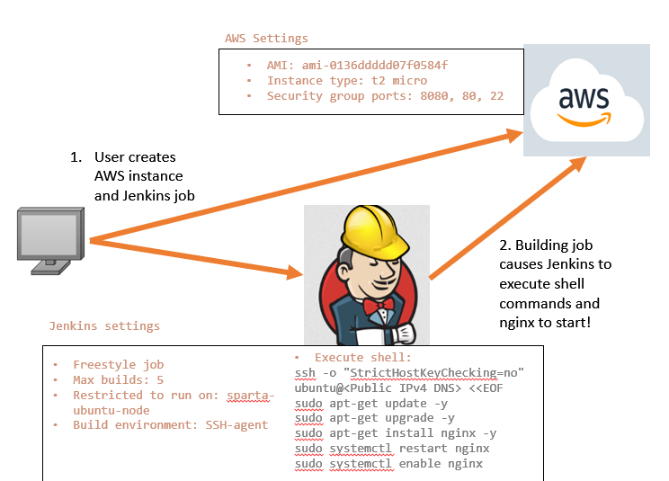

### We can then further automate this process, so that this new job becomes part of our previous pipeline.

1. Return to job 3 config and change the build trigger to the 2nd job (the job that automatically merges dev and main). This will automatically build this job provided the previous job built successfully.

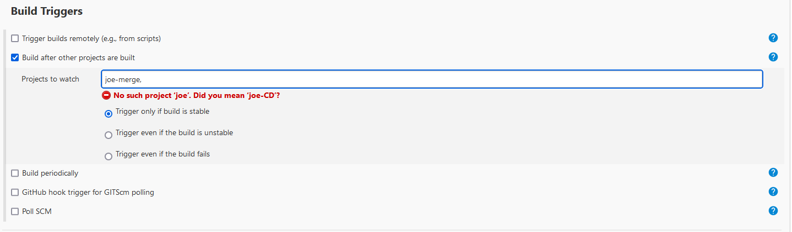

2. Push to github dev branch to test, we should expect all 3 jobs to build successfully one after another!

