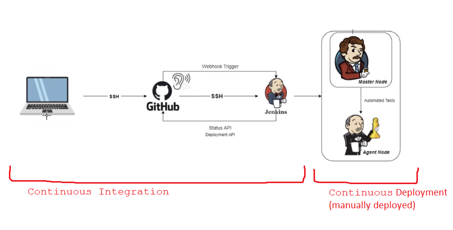
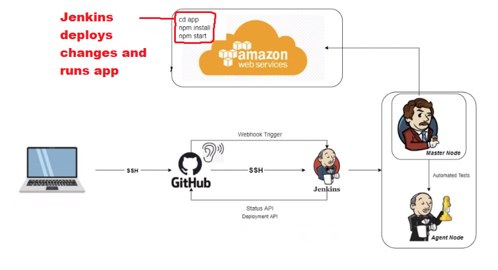
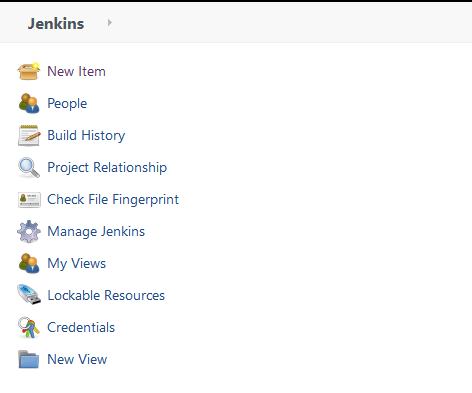
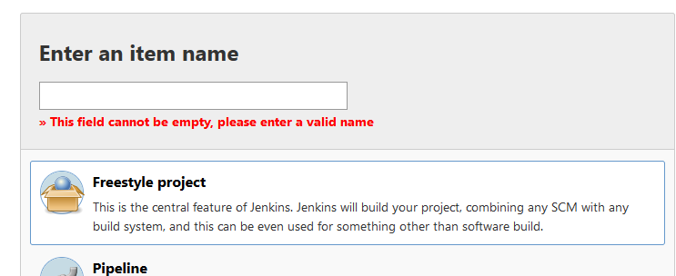
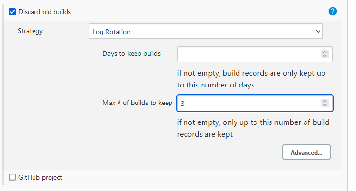
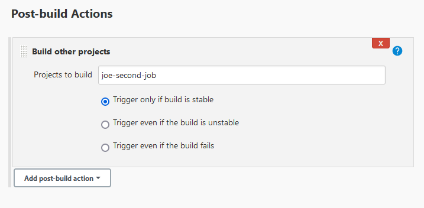

# Jenkins CI-CD pipeline

Aim of CI-CD is to fully automate app deployment from scratch to help deliver software faster, speeding up updates and making more money.

Local code -> github -> automation server (via webhook trigger) -> jenkins -> master node (tests code on agent node) -> pushed to deployment if test successful

Error logs are returned on failed deploy.



If this was continuous deployment, then the app would be deployed from the master branch.



This is essentially the same as when you tested deployment with render.

You'll want continuous delivery when you don't want the application to be available to customers right away.
- Continuous delivery lets you do new deploys instead when client specifications change
- Also lets you do additional, manual testing among other reasons

# Webhook

Webhook used for automation.

It always listens to changes in your github.

When changes occur, this repo will be cloned by jenkins.

# Building job in jenkins

- Click new item



- Name it appropriately 
- Click freestyle then OK



- Give appropriate description
- Tick 'discard old builds'



- Go to build and select 'execute shell'
- Include the following code
``` 
whoami
uname -a
```
- Click apply and save
- Can then run this on the list of jobs
- Go on job summary and click on the job under build history to see console log

# Automating start of next job
- Configure new/existing job
- go to bottom and under post build options click build other project
- Type the name of the next job you want



- **Practically** you'll use this to make jenkins clone the repo if the code deployed successfully

## Connect Jenkins to github
- Create new key pair
- Go to settings then deploy keys
- Put public key in field 
- Tick allow write access