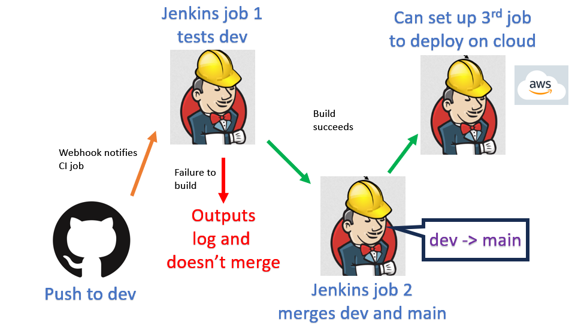
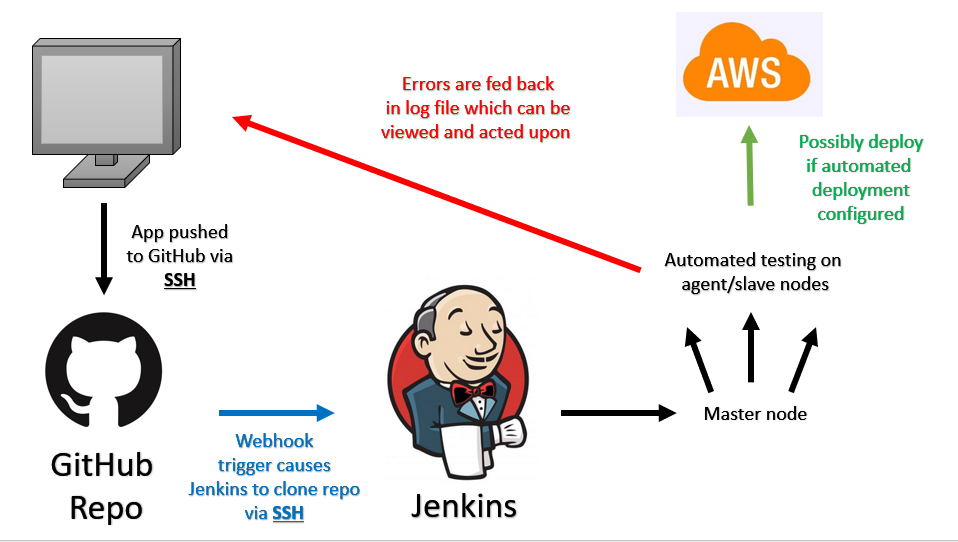

# Jenkins CI-CD pipeline

Aim of CI-CD is to fully automate app deployment from scratch to help deliver software faster, speeding up updates and making more money.

Local code -> github -> automation server (via webhook trigger) -> jenkins -> master node (tests code on agent node) -> pushed to deployment if test successful

Error logs are returned instead of deployment if app doesn't function as expected.


If this was continuous deployment, then the app would be deployed from the master node.


This is essentially the same as when you tested deployment with render.

You'll want continuous delivery when you don't want the application to be available to customers right away.
- Continuous delivery lets you do new deploys instead when client specifications change
- Also lets you do additional, manual testing among other reasons
- Then when you're ready you can deploy

# Webhooks

Webhooks are used for automation.

It always listens to changes in your github.

When changes occur, this repo will be cloned by jenkins and pipeline starts.

# Building job that tests app in jenkins

First, make sure the app is available in your Github repo, and on the dev branch!

1. Click new item


2. Name it appropriately, then click freestyle and OK
- We want freestyle as it provides the customisation options needed for CI-CD


3. Give appropriate description
4. Tick 'discard old builds' and set number of builds to 3
- This will discard the 1st build logs when a 4th one is made, saves space


Move to **Github**

5. Create new key pair
6. Go to settings then deploy keys
7. Put public key in field 
8. Tick allow write access

- This is the key we will be providing to Jenkins so it can clone our repo.

Then move to **Jenkins**

9. When setting up github connection in jenkins
10. Tick github project here and enter the repo HTTPS


11. Then under source code management tick git and paste your repository SSH


12. Then add the private key for the key you linked to your GitHub earlier


13. You also need to restrict where this can be run using the option under office 365 connector 
- We use the label expression `sparta-ubuntu-node`
- This ensures this only runs on a specific agent/slave node

14. Go to build and select 'execute shell'
15. Include the following code
``` 
#!/bin/bash
cd app/app
npm install
npm test
```
16. Click apply and save

When this job is built, it will run the predefined tests on our application to ensure it can run.

You can view results of test in the logs!

## Running tests when app repo is updated, testing dev then merging dev to main if successful

Make a new job and set it up exactly the same way as the previous job!

However, make the following changes.

1. Go to config on **Jenkins** and tick github trigger in build triggers


2. You also want to add **merge before build** as an additional behaviour, then specify this should merge with **main**.


3. go to bottom and under post build options click build other project
- Type the name of the next job you want, which in our case is the app test job we made earlier as we want this to be built once the test job succeeds.


4. Finally, you need to add post build actions so Jenkins knows what to do with the dev branch. If you select **push only if the build succeeds** and **merge results** this will push a merge request once the build finishes. The reason we do it like this is because the merge before build option will test if the branches are accessable and exist, and then the build will succeed. Once it's succeeded then it will merge.


5. Then go to settings in **github repo** and go to webhooks in the dropdown
- Paste the payload URL, which is the URL of Jenkins 
- Should be in this format `http://address:port/github-webhook/`
- Change content type to application/json

6. Then return to the testing (first) job you made and change post build to build other projects and select the merge (second) job you made.


This creates the following pipeline, that has Jenkins test if the app works, then if it does it allows Jenkins to merge dev with main/master.



## Letting Jenkins create AWS instance

1. Make new job, do the exact same setup as the 1st job except its connected to the main branch instead of dev.

2. Set AWS code deploy plugin as post build

3. Additionally, go to merge job and add post build setting to build this new job.

4. Go back to the new job and tick SSH agent and add AWS key (using doz' for this)

5. Make ASG that allows Jenkins IP with Jenkins port (8080)

You should have set something like this up.

](jenk_test_merge.png)


